# Project 01 - Nmap Reconnaissance Detection and Triage

**Date:** 2026-05-17
**Analyst:** Halil Ibrahim Yilmaz
**Severity:** Medium
**Status:** Closed

---

## Objective

The goal of this project was to simulate a network reconnaissance attack in the home SOC lab and observe how Security Onion detects and alerts on the activity. Kali Linux was used as the attacking machine and Metasploitable2 as the target. Security Onion monitored all traffic passing through the soclab network segment.

---

## Environment

| Component | Details |
|---|---|
| Attacker | Kali Linux - 192.168.100.10 |
| Target | Metasploitable2 - 192.168.100.30 |
| Monitor | Security Onion 2.4.211 - bond0 (soclab) |

---

## Attack Summary

Three Nmap scans were performed in sequence against the target machine, each designed to gather different types of information.

### Scan 1 - SYN Scan

```
sudo nmap -sS 192.168.100.30
```

A stealth scan that sends SYN packets without completing the TCP handshake. Fast and quiet compared to a full connect scan. This revealed 23 open ports on the target including FTP (21), SSH (22), Telnet (23), HTTP (80), MySQL (3306), PostgreSQL (5432), VNC (5900), and several others. The number of open ports immediately indicated this was a heavily misconfigured system.

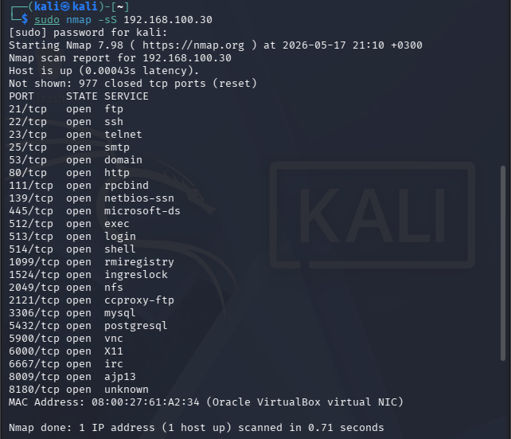

### Scan 2 - Version Detection

```
sudo nmap -sV 192.168.100.30
```

Sent additional probes to identify the software running on each open port. This returned specific version information including vsftpd 2.3.4 on FTP, OpenSSH 4.7p1 on SSH, Apache 2.2.8 on HTTP, MySQL 5.0.51a, and PostgreSQL 8.3.0. Each of these versions has known vulnerabilities that an attacker could use as a starting point for exploitation.

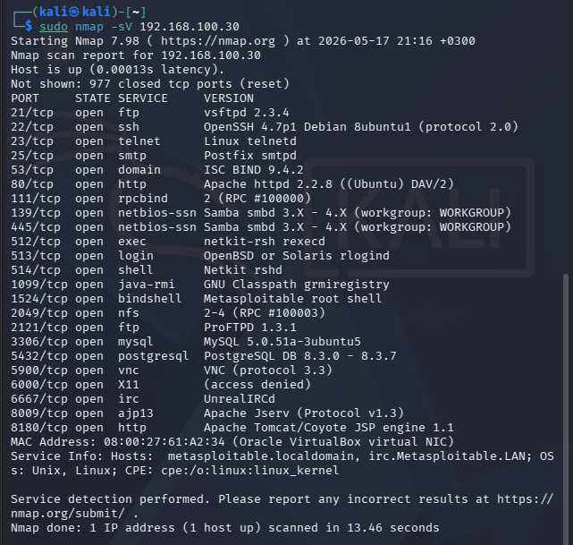

### Scan 3 - UDP Scan

```
sudo nmap -sU --top-ports 20 192.168.100.30
```

Probed the top 20 most common UDP ports. Found open or filtered ports on DNS (53), DHCP (67/68), TFTP (69), NetBIOS (137), and SNMP (161) among others.

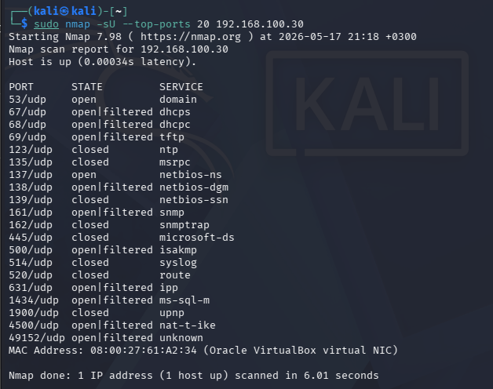

---

## Alerts Generated

Security Onion produced 52 total alert events grouped into 17 distinct rules across the three scans.

### After SYN Scan - 5 alerts

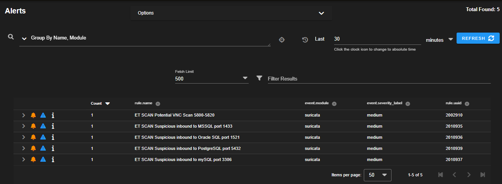

### After Version Detection - 12 alerts

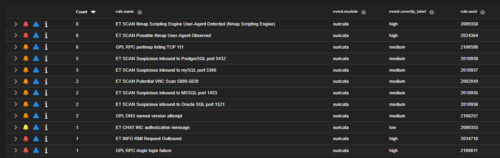

### After All Three Scans - 17 alert groups, 52 total events

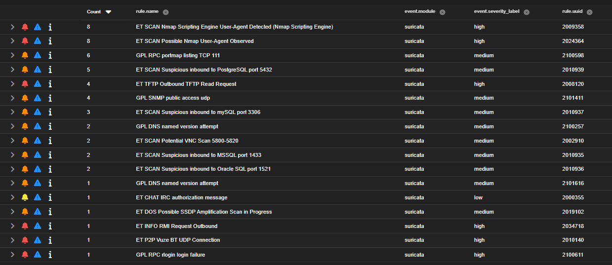

| Alert | Severity | Count |
|---|---|---|
| ET SCAN Nmap Scripting Engine User-Agent Detected | High | 8 |
| ET SCAN Possible Nmap User-Agent Observed | High | 8 |
| GPL RPC portmap listing TCP 111 | Medium | 6 |
| ET SCAN Suspicious inbound to PostgreSQL port 5432 | Medium | 5 |
| ET TFTP Outbound TFTP Read Request | High | 4 |
| GPL SNMP public access udp | Medium | 4 |
| ET SCAN Suspicious inbound to mySQL port 3306 | Medium | 3 |
| ET SCAN Potential VNC Scan 5800-5820 | Medium | 2 |
| ET SCAN Suspicious inbound to MSSQL port 1433 | Medium | 2 |
| ET SCAN Suspicious inbound to Oracle SQL port 1521 | Medium | 2 |
| GPL DNS named version attempt | Medium | 2 |
| ET DOS Possible SSDP Amplification Scan in Progress | Medium | 1 |
| ET INFO RMI Request Outbound | High | 1 |
| ET P2P Vuze BT UDP Connection | High | 1 |
| GPL RPC rlogin login failure | High | 1 |
| ET CHAT IRC authorization message | Low | 1 |

---

## Key Findings

### Nmap was fingerprinted by its own user-agent

The most interesting detection came from the version scan. When Nmap's scripting engine probed the web services on ports 80 and 8180, it sent HTTP requests with a distinctive user-agent string:

```
User-Agent: Mozilla/5.0 (compatible; Nmap Scripting Engine; https://nmap.org/book/nse.html)
```

Suricata caught this immediately. The attacker's tool was identified before any exploitation was even attempted.

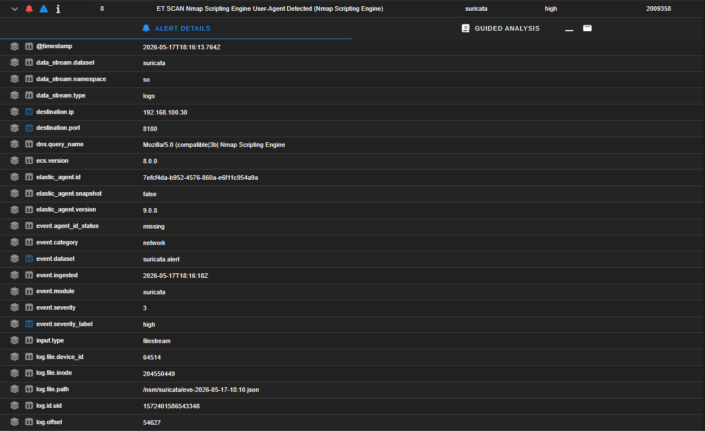

The raw packet payload was also captured, showing the full HTTP request:

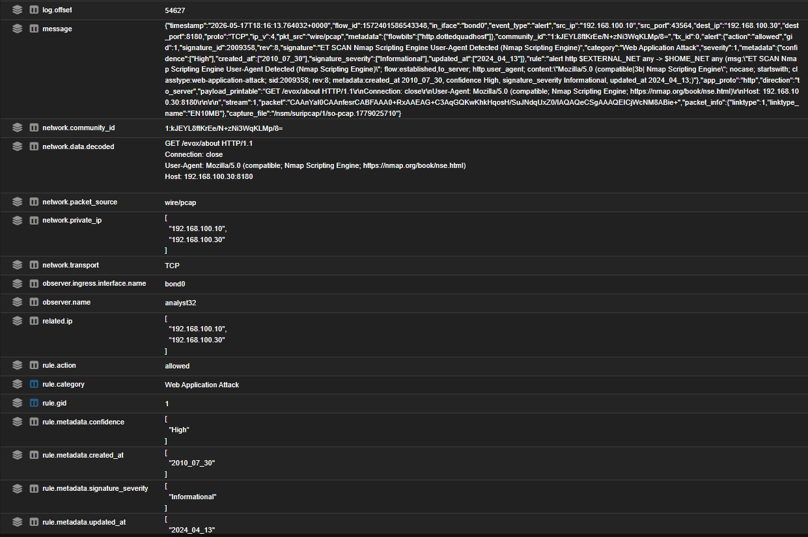

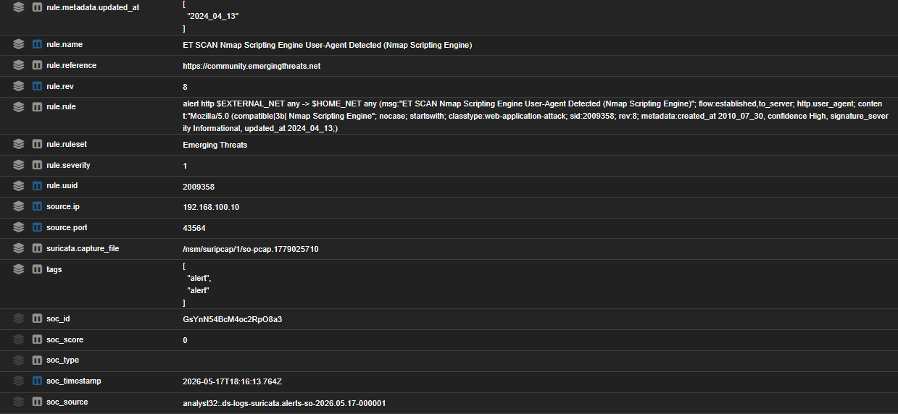

### Exposed services represent significant attack surface

Version detection returned specific software versions across all open ports. vsftpd 2.3.4 contains a backdoor vulnerability (CVE-2011-2523) with a public Metasploit exploit. OpenSSH 4.7p1 and Apache 2.2.8 are both end-of-life versions with unpatched CVEs. An attacker with this information would have multiple straightforward exploitation paths available without needing any further reconnaissance.

### Database ports generated the most alerts

Suricata had specific rules for each database port being scanned, covering MySQL, PostgreSQL, MSSQL, and Oracle. Each triggered separately. This illustrates how signature-based detection works: a single scan generates multiple alerts, each one mapping to a different service being probed.

### UDP scan triggered high-severity alerts

The TFTP alert fired during the UDP scan. TFTP has no authentication by default, making it a target for attackers looking for easy file access. SNMP with a public community string is a classic misconfiguration that exposes device configuration and network topology information to any host that queries it.

---

## Detection Limits - Slow Scan Test

After completing the initial scans, a question came up naturally: the standard Nmap scans generated 52 alerts across 17 rules, including user-agent fingerprinting. Was that level of detection a result of how noisy the scans were, or would Suricata catch a quieter approach just as effectively?

To find out, the same SYN scan was repeated with a 1-second delay between each probe:

```
sudo nmap -sS --scan-delay 1s 192.168.100.30
```

The scan completed in 1003 seconds compared to a few seconds for the standard scan. The results were significantly different.

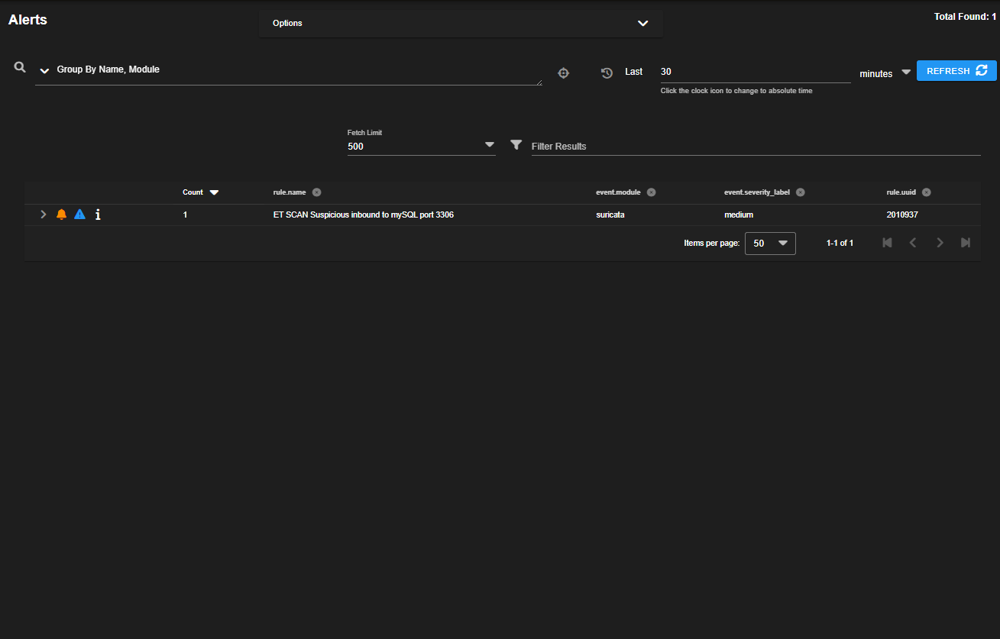

| | Standard scan | Slow scan (1s delay) |
|---|---|---|
| Total alerts | 52 | 4 |
| Alert groups | 17 | 4 |
| Nmap user-agent detected | Yes | No |
| Rate-based rules triggered | Yes | No |
| Port-based rules triggered | Yes | Yes |
| TFTP, SNMP, RPC alerts | Yes | No |

The slow scan evaded all rate-based and user-agent detection rules entirely. Only four port-specific signature rules fired, one each for MySQL, PostgreSQL, MSSQL, and Oracle. These rules trigger on any connection attempt to those ports regardless of scan speed, so they cannot be evaded by timing alone.

This confirms that the high alert volume in the original scan was partly a result of scan speed and tool fingerprinting. A more patient attacker using a custom tool without a recognizable user-agent would generate significantly less noise, potentially only the four port-based alerts seen here.

---

## MITRE ATT&CK Mapping

| Technique | ID | Observed Activity |
|---|---|---|
| Active Scanning | T1595 | All three Nmap scan types |
| Scanning IP Blocks | T1595.001 | SYN scan across port range |
| Vulnerability Scanning | T1595.002 | Version detection (-sV) |
| Gather Victim Host Information | T1592 | Service version banners collected |

---

## Triage Outcome

All 52 alerts were reviewed and classified as true positives. The scanning activity occurred exactly as the rules described. A case was opened in Security Onion's case management module and closed after documenting the findings.

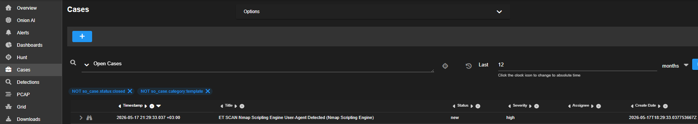

In a real environment, this volume of scanning activity from a single internal IP within a short time window would warrant immediate investigation. The source IP would be flagged for monitoring and, after confirming malicious intent, blocked at the firewall level. The combination of rapid sequential port scanning, Nmap fingerprinting, and successful HTTP responses is a strong indicator of active reconnaissance preceding an exploitation attempt.

---

## Recommendations

**Block the scanning host after confirmation.** Once scanning behavior is confirmed as malicious and not an authorized internal activity such as a scheduled vulnerability scan, the source IP should be isolated at the network level to prevent progression to exploitation.

**Reduce the exposed attack surface.** 23 open ports on a single host is excessive. Services not required for business operations should be disabled. vsftpd 2.3.4 and other end-of-life software should be updated or replaced. These are not theoretical risks but actively exploited vulnerabilities with public proof-of-concept code available.

**Supplement signature-based detection with behavioral baselines.** The slow scan test showed that timing-based evasion significantly reduces alert volume. Establishing connection frequency baselines per source IP and alerting on deviations would catch low-and-slow reconnaissance that evades rate-based rules.

**Disable SNMP public community string.** SNMP with default public access was flagged during the UDP scan. This exposes network topology and device information and should be either disabled or restricted to specific management hosts with a non-default community string.

---

*This report was produced as part of a home SOC lab exercise. All activity occurred in an isolated virtual network. No real systems were targeted.*
