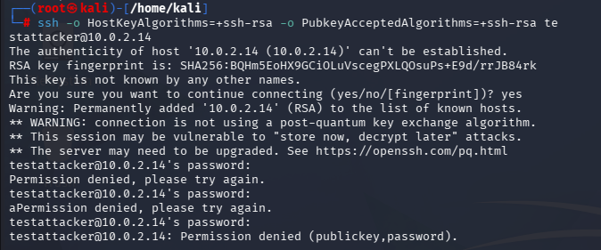
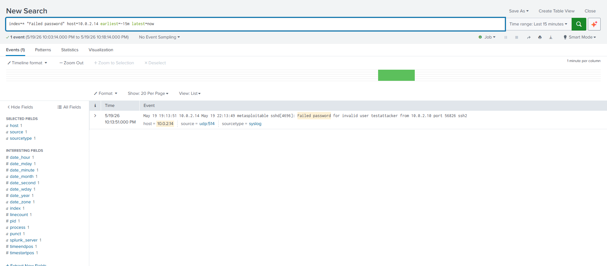
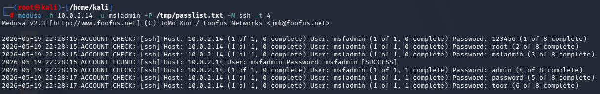
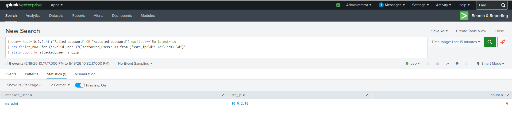
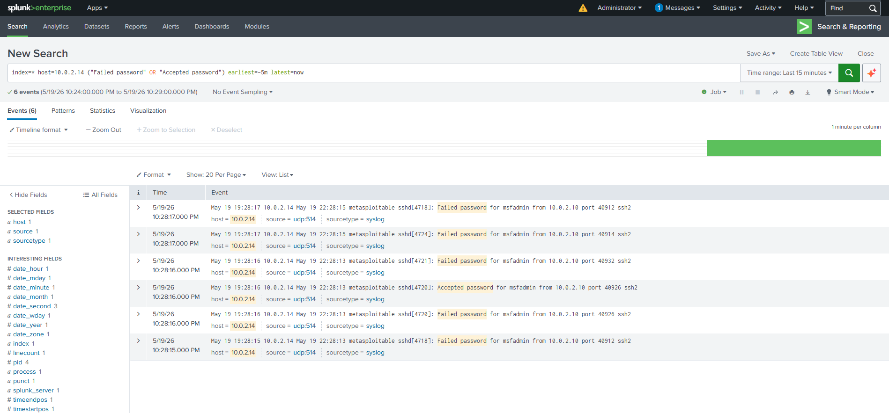

# Project 02 — SSH Brute Force Detection with Splunk

**Date:** 2026-05-19  **Analyst:** Halil Ibrahim Yilmaz  **Level:** Home SOC Lab / Learning Project  **Status:** Completed

---

## Goal

The goal of this lab was to forward SSH authentication logs from a Linux victim machine into Splunk SIEM and detect a basic SSH brute force attempt launched from Kali Linux.

At first, I used a simple `tail -F | nc -u` pipeline to send logs from Metasploitable to Splunk. This worked during the first small tests, but when I started generating repeated SSH login attempts, I noticed that some logs arrived late or did not appear as expected. Because of that, I switched to a more proper log forwarding setup using `rsyslog`.

This project was not only about detecting brute force activity. It also gave me practice with log forwarding, timestamp issues, old Linux package repositories, Splunk inputs, and troubleshooting a SIEM pipeline step by step.

---

## Lab Environment

| Role | System | IP Address |
|---|---|---|
| Attacker | Kali Linux | `10.0.2.10` |
| Victim | Metasploitable2 | `10.0.2.14` |
| SIEM | Splunk Enterprise 10.2.3 | `10.0.2.11` |
| Network | VirtualBox NAT Network | `SOC_Lab_Network` |


All VMs were connected to the same VirtualBox NAT Network. I used port forwarding to access some VM services from the host machine:

- `127.0.0.1:2223` → Metasploitable SSH
- `127.0.0.1:2222` → Splunk SSH
- `127.0.0.1:8000` → Splunk Web UI

---

## General Architecture

```text
[ Kali Linux - 10.0.2.10 ]
          |
          | SSH login attempts
          v
[ Metasploitable2 - 10.0.2.14 ]
          |
          | /var/log/auth.log
          | rsyslog forwarding over UDP/514
          v
[ Splunk - 10.0.2.11 ]
          |
          | sourcetype=syslog
          v
[ Search / Detection ]
```

In this setup, Kali was used as the attacker machine. SSH login attempts against Metasploitable were written to `/var/log/auth.log`. These authentication logs were then forwarded to Splunk using `rsyslog`.

---

## Log Forwarding Setup

At the beginning, I used this command:

```bash
sudo tail -F /var/log/auth.log | nc -u 10.0.2.11 514
```

This worked for basic testing, but it was not reliable when I generated more login attempts. Some logs appeared with delay, and it was not a good long-term solution.

I replaced this with `rsyslog` on Metasploitable and configured it to forward authentication logs to Splunk.

The forwarding rules I used were:

```text
auth.*       @10.0.2.11:514
authpriv.*   @10.0.2.11:514
```

I added these rules to:

```text
/etc/rsyslog.d/50-splunk-forward.conf
```

The `@` symbol means UDP forwarding. Since Splunk was already listening on UDP port 514, the logs started arriving with `sourcetype=syslog`.

---

## First Validation in Splunk

After configuring forwarding, I first sent test logs to confirm that Splunk was receiving events from Metasploitable before running the real SSH test.

In Splunk, I confirmed that events were arriving with these fields:

- `host=10.0.2.14`
- `source=udp:514`
- `sourcetype=syslog`

Then I made a manual SSH attempt from Kali:

```bash
ssh -o HostKeyAlgorithms=+ssh-rsa -o PubkeyAcceptedAlgorithms=+ssh-rsa testattacker@10.0.2.14
```



After this attempt, I was able to see `Failed password` events in Splunk.



At this point, I confirmed that the log pipeline was working.

---

## Brute Force Test

After the manual test, I used a small password list for the brute force attempt.

Password list:

```text
123456
password
admin
root
toor
msfadmin
letmein
qwerty
```

I first tried Hydra, but I ran into algorithm compatibility issues between modern Kali tools and the old OpenSSH version running on Metasploitable. The connection failed because of legacy SSH algorithm negotiation problems.

For that reason, I used Medusa for the brute force test:

```bash
medusa -h 10.0.2.14 -u msfadmin -P /tmp/passlist.txt -M ssh -t 4
```



Medusa found the valid credential `msfadmin:msfadmin` and reported a successful login. During this test, I checked whether both failed and successful authentication events appeared in Splunk.

---

## Detection in Splunk

After the brute force attempt, I used this Splunk search:

```spl
index=* host=10.0.2.14 ("Failed password" OR "Accepted password") earliest=-15m latest=now
| rex field=_raw "for (invalid user )?(?<attacked_user>\S+) from (?<src_ip>\d+\.\d+\.\d+\.\d+)"
| stats count by attacked_user, src_ip
```

With this query, I extracted two fields from the raw SSH logs:

- targeted username
- attacker source IP address

Then I used `stats` to summarize the number of events for the same user and source IP.



Result:

| attacked_user | src_ip | count |
|---|---|---|
| msfadmin | 10.0.2.10 | 6 |

This result showed multiple SSH authentication attempts from `10.0.2.10` against the `msfadmin` user.

The timeline also showed a short burst of authentication activity:



This was useful because instead of only looking at raw logs one by one, I was able to create a more readable summary of the activity.

---

## Issues I Ran Into

The most useful part of this lab was not only running the attack, but troubleshooting the logging and Splunk pipeline.

### 1. The `tail | nc` Pipeline Was Not Reliable

My first forwarding method was:

```bash
sudo tail -F /var/log/auth.log | nc -u 10.0.2.11 514
```

It looked simple, but it was not stable enough during repeated SSH attempts. Some logs were delayed or did not show up in Splunk immediately.

I replaced it with `rsyslog`, which made the forwarding more consistent and easier to manage as a service.

---

### 2. Package Installation Issues on Metasploitable

Metasploitable2 is an old system, so I had repository problems during `apt-get update`. The default Ubuntu Hardy repository URLs were no longer active, so packages could not be downloaded.

There was also a DNS issue. I first added DNS servers to `/etc/resolv.conf`, then changed `sources.list` to use `old-releases.ubuntu.com`.

After that, I was able to install `rsyslog`.

---

### 3. Timezone / Timestamp Issue

At first, Metasploitable and Splunk were using different timezones. Because of this, short time-range searches such as "Last 15 minutes" did not always show the events I expected.

I changed the timezone on Metasploitable to `Europe/Istanbul`. I also added this timezone setting for syslog events on the Splunk side:

```text
[syslog]
TZ = Europe/Istanbul
```

After this change, the event timestamps looked more consistent.

---

### 4. SSH Algorithm Compatibility Issue

Metasploitable uses an old OpenSSH version, so modern Kali tools had problems connecting to it with default SSH settings.

For manual SSH, I had to use these options:

```bash
ssh -o HostKeyAlgorithms=+ssh-rsa -o PubkeyAcceptedAlgorithms=+ssh-rsa ...
```

Hydra also had compatibility problems, so I used Medusa instead for the brute force test.

---

### 5. Splunk Disk Space Warning

At one point, I could see packets reaching the Splunk VM, but some events were not appearing in search results. I checked UDP 514 traffic with `tcpdump` and confirmed that Splunk was listening on the correct port.

Later, I noticed a disk space warning in Splunk Health Status. Splunk can change indexing behavior when available disk space is below its configured threshold.

I expanded the LVM disk space on the Splunk VM:

```bash
sudo lvextend -l +100%FREE /dev/ubuntu-vg/ubuntu-lv
sudo resize2fs /dev/ubuntu-vg/ubuntu-lv
```

After increasing the disk space, the events started appearing in search results again.

---

## What I Learned

This lab helped me understand several important points.

### Temporary commands are not enough for log forwarding

Commands like `tail | nc` can be useful for quick testing, but they are not ideal for reliable log collection. Using a service like `rsyslog` gave better results in this lab.

### SIEM troubleshooting should be done layer by layer

When an event does not appear in Splunk, the issue is not always the search query. In this lab, I had to check different layers one by one:

- Is the log being created on the victim machine?
- Is rsyslog forwarding the log?
- Is Splunk listening on UDP 514?
- Is the packet reaching the Splunk VM?
- Is Splunk indexing the event?
- Is the search time range correct?

Checking these layers in order made troubleshooting easier.

### Detection should focus on behavior

When Hydra failed to connect, the attack did not actually reach the victim machine, so Splunk had nothing to detect from Hydra.

This showed me that detection logic should focus on behavior, not just specific tools. In this case, the behavior was repeated authentication attempts from the same IP address against the same username.

---

## MITRE ATT&CK Mapping

| Technique | ID | Description |
|---|---|---|
| Brute Force | T1110 | Repeated password attempts against one user |
| Password Guessing | T1110.001 | Password list used with Medusa |
| Valid Accounts | T1078 | Successful login after the correct password was found |
| Remote Services: SSH | T1021.004 | Access attempt over SSH |

---

## Result

At the end of this lab, I was able to see SSH authentication attempts from Kali to Metasploitable in Splunk. I also wrote a basic SPL query to summarize the source IP, target user, and number of attempts.

For me, the most valuable part of the project was understanding why some logs were not appearing in Splunk and how to troubleshoot the pipeline. During the lab, I worked through rsyslog setup, timestamp issues, old Linux repository problems, SSH algorithm compatibility, and a Splunk disk warning.

This project helped me practice a basic SSH brute force detection workflow and understand SIEM log pipeline troubleshooting at a beginner-friendly level.

---

## Possible Future Improvements

This lab could be improved further by adding:

- a saved Splunk alert based on the SPL query
- a threshold such as `count >= 5` within a short time window
- a correlation search for failed logins followed by a successful login
- a Splunk dashboard
- fail2ban or sshguard for detection + response testing
- similar tests for other services such as FTP, Telnet, or HTTP login pages

---

## Note

This project was completed in an isolated home lab environment. No real systems were targeted.
