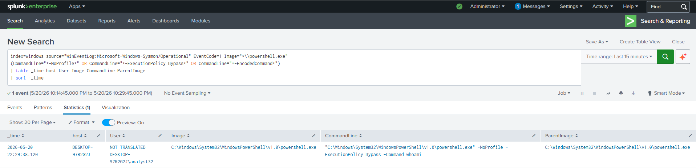
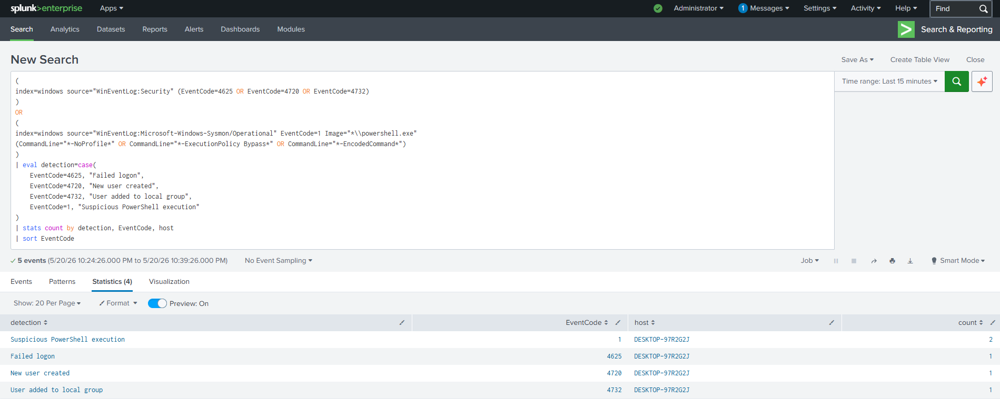

# Project 03 — Windows Endpoint Monitoring with Sysmon and Splunk

A home SOC lab exercise focused on collecting Windows endpoint telemetry with Sysmon and Windows Event Logs, forwarding the events to Splunk, and detecting common endpoint behaviors that matter in SOC investigations.

## What I Did

Built a Windows endpoint monitoring pipeline in an isolated VirtualBox NAT network. A Windows 10 endpoint generated Security, System, and Sysmon events, and a Splunk Universal Forwarder sent those logs to a Splunk Enterprise server running on Ubuntu.

- **Endpoint** (`10.0.2.3`): Windows 10 with Sysmon and Windows audit policy enabled
- **SIEM** (`10.0.2.11`): Splunk Enterprise on Ubuntu Server
- **Index**: `windows`
- **Forwarding**: Splunk Universal Forwarder over TCP/9997

## What I Built

Configured Sysmon and Windows auditing to capture endpoint activity such as process creation, failed logons, local user creation, and local group membership changes. Then I validated that these events were searchable in Splunk and wrote basic SPL detections around them.

The main log sources were:

- `WinEventLog:Security`
- `WinEventLog:System`
- `WinEventLog:Microsoft-Windows-Sysmon/Operational`

## What Splunk Detected

The lab focused on four endpoint behaviors:

- **User added to local Administrators group** — Windows Security Event ID `4732`
- **Suspicious PowerShell execution** — Sysmon Event ID `1`
- **New local user created** — Windows Security Event ID `4720`
- **Failed logon attempt** — Windows Security Event ID `4625`

The most useful detection was the PowerShell process creation event. Sysmon showed not only that `powershell.exe` ran, but also the full command line, including `-NoProfile` and `-ExecutionPolicy Bypass`. This made the event much more useful than a basic process name match.

## Detection Summary

Splunk was able to summarize the generated Security and Sysmon events by detection type and Event ID. This made it easier to verify that the endpoint behaviors were captured correctly.

## Notes from the Lab

A few small setup issues came up during the project:

- Sysmon installation required an elevated PowerShell session.
- On a Turkish Windows system, `auditpol` subcategory names had to be written in Turkish instead of English.
- The first Universal Forwarder download URL returned `404`, so I used the current Windows x64 MSI from Splunk's download page.

These were minor issues, but they were useful reminders that endpoint monitoring work often involves checking permissions, system language, and current tool versions.

## Tools Used

- Sysmon
- Windows Event Log
- Splunk Universal Forwarder
- Splunk Enterprise
- PowerShell
- Oracle VirtualBox

## Full Report

Detailed setup notes, SPL queries, screenshots, detection results, and MITRE ATT&CK mapping: [analysis-report.md](./analysis-report.md)
