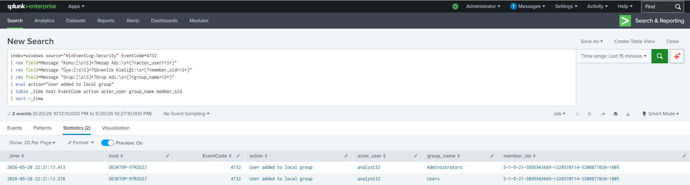
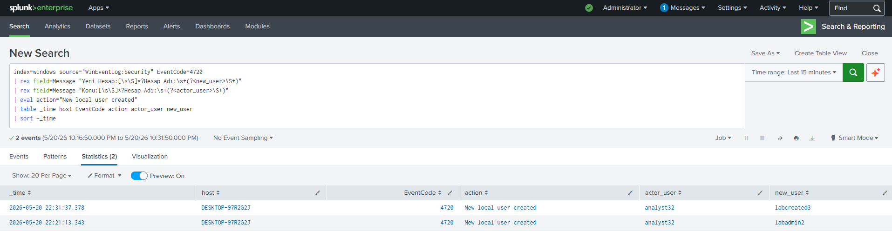
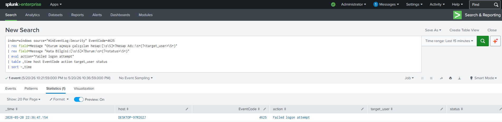
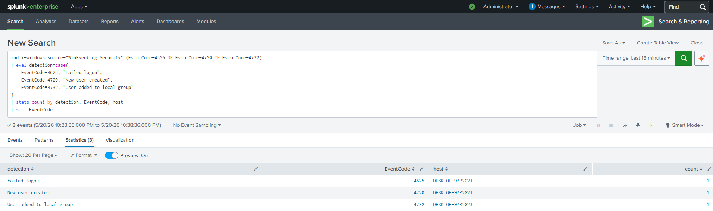

# Project 03 — Windows Endpoint Monitoring with Sysmon and Splunk

**Date:** 2026-05-20  **Analyst:** Halil Ibrahim Yilmaz  **Level:** Home SOC Lab / Learning Project  **Status:** Completed  

---

## Goal

The goal of this lab was to monitor a Windows 10 endpoint with Sysmon and Windows Event Logs, forward those logs to Splunk, and detect basic endpoint activities that are important for SOC analysts.

This project was not only about installing Sysmon or sending Windows logs to Splunk. The main goal was to understand how Windows endpoint behavior appears in a SIEM and how Security and Sysmon events can be used to detect activity such as suspicious PowerShell execution, local user creation, failed logons, and local administrator group changes.

In my previous Splunk lab, I forwarded Linux authentication logs and detected SSH brute force activity. In this project, I moved the same detection mindset to a Windows endpoint environment.

---

## Lab Environment

| Role | System | IP Address |
|---|---|---|
| Endpoint | Windows 10 | `10.0.2.3` |
| SIEM | Splunk Enterprise on Ubuntu Server | `10.0.2.11` |
| Network | VirtualBox NAT Network | `10.0.2.0/24` |

Splunk Web was accessed from the host machine through:

```text
http://127.0.0.1:8000
```

Splunk received forwarded Windows logs over TCP port `9997`.

---

## General Architecture

```text
[ Windows 10 Endpoint - 10.0.2.3 ]
        |
        | Windows Security Logs
        | Windows System Logs
        | Sysmon Operational Logs
        |
        | Splunk Universal Forwarder
        | TCP/9997
        v
[ Splunk Enterprise - 10.0.2.11 ]
        |
        | index=windows
        v
[ Search / Detection ]
```

The Windows endpoint generated both native Windows Security events and Sysmon events. Splunk Universal Forwarder was used to send these logs to Splunk Enterprise. I used a separate index called `windows` to keep the Windows endpoint logs separate from other lab data.

---

## Tools Used

| Tool | Purpose |
|---|---|
| Sysmon | Endpoint telemetry collection |
| Windows Event Log | Native Windows security and system events |
| Splunk Universal Forwarder | Log forwarding from Windows to Splunk |
| Splunk Enterprise | Log indexing, searching, and detection |
| PowerShell | Endpoint configuration and test activity generation |

---

## Log Sources

The main log sources used in this lab were:

```text
WinEventLog:Security
WinEventLog:System
WinEventLog:Microsoft-Windows-Sysmon/Operational
```

The most important event IDs for this project were:

| Event ID | Source | Description |
|---:|---|---|
| 1 | Sysmon | Process creation |
| 4625 | Windows Security | Failed logon |
| 4720 | Windows Security | New local user created |
| 4732 | Windows Security | User added to a security-enabled local group |

---

## Setup Summary

I installed Sysmon on the Windows 10 endpoint and configured Windows audit policy to generate the Security events needed for this lab.

The Splunk Universal Forwarder was installed on the Windows endpoint and configured to forward Security, System, and Sysmon Operational logs to the Splunk server at:

```text
10.0.2.11:9997
```

The logs were indexed under:

```text
index=windows
```

After the forwarding pipeline was working, I generated controlled test activity from the Windows endpoint and searched for the resulting events in Splunk.

---

## Detection 1 — User Added to Local Administrators Group

### Objective

The first detection scenario was to identify when a local user was added to the local Administrators group.

This type of activity is important because attackers may add a user to a privileged group to maintain access or increase privileges on a compromised host.

### Test Command

On the Windows endpoint, I created a test user and added it to the local Administrators group:

```powershell
net user labadmin2 P@ssw0rd123! /add
net localgroup administrators labadmin2 /add
```

### SPL Query

```spl
index=windows source="WinEventLog:Security" EventCode=4732
| table _time host EventCode Message
| sort -_time
```

### Result

Splunk detected Windows Security Event ID `4732`, showing that a member was added to a security-enabled local group. In this case, the group was `Administrators` and the action was performed by the `analyst32` user.



This event is useful for detecting unauthorized privilege changes on Windows endpoints.

---

## Detection 2 — Suspicious PowerShell Execution

### Objective

The second detection scenario focused on suspicious PowerShell execution.

PowerShell is a legitimate administration tool, but attackers often use it for discovery, execution, payload download, and defense evasion. In this lab, I focused on command-line patterns such as:

```text
-NoProfile
-ExecutionPolicy Bypass
-EncodedCommand
```

These parameters are not always malicious by themselves, but they are useful indicators when reviewing endpoint activity.

### Test Command

On the Windows endpoint, I generated a controlled PowerShell event:

```powershell
powershell.exe -NoProfile -ExecutionPolicy Bypass -Command "whoami"
```

### SPL Query

```spl
index=windows source="WinEventLog:Microsoft-Windows-Sysmon/Operational" EventCode=1 Image="*\\powershell.exe"
(CommandLine="*-NoProfile*" OR CommandLine="*-ExecutionPolicy Bypass*" OR CommandLine="*-EncodedCommand*")
| table _time host User Image CommandLine ParentImage
| sort -_time
```

### Result

Splunk detected the PowerShell process through Sysmon Event ID `1`. The result showed the process image, command line, parent process, user, and host.


This was one of the most useful detections in the lab because it showed why command-line visibility matters. Seeing only `powershell.exe` is not enough. The command-line arguments explain what the process was trying to do.

---

## Detection 3 — New Local User Created

### Objective

The third detection scenario was to identify local user creation.

Attackers may create local users for persistence or future access. Windows Security Event ID `4720` records when a new user account is created.

### Test Command

On the Windows endpoint, I created a new local test user:

```powershell
net user labcreated3 P@ssw0rd123! /add
```

### SPL Query

```spl
index=windows source="WinEventLog:Security" EventCode=4720
| table _time host EventCode Message
| sort -_time
```

### Result

Splunk detected Event ID `4720`, confirming that a new local user account was created.



This detection is useful because new local accounts are not usually created frequently on normal workstations. In a real environment, this activity would need to be reviewed in context.

---

## Detection 4 — Failed Logon Attempt

### Objective

The fourth detection scenario was to identify failed logon attempts.

Failed logon events can be caused by normal user mistakes, but repeated failures may indicate password guessing, brute force attempts, misconfigured services, or unauthorized access attempts.

### Test Command

On the Windows endpoint, I generated a failed logon event by trying to run a command as a fake user:

```powershell
runas /user:FakeUser cmd
```

I entered an incorrect password to generate the failure.

### SPL Query

```spl
index=windows source="WinEventLog:Security" EventCode=4625
| table _time host EventCode Message
| sort -_time
```

### Result

Splunk detected Windows Security Event ID `4625`, which represents a failed logon attempt.



In a real SOC workflow, a single failed logon may not be critical. The value comes from looking for patterns such as repeated failures from the same source, multiple targeted accounts, or failed logons followed by successful authentication.

---

## Detection Summary

After testing the individual detections, I used summary searches to confirm that the expected Windows Security events were visible in Splunk.

### Security Event Summary

```spl
index=windows source="WinEventLog:Security" (EventCode=4625 OR EventCode=4720 OR EventCode=4732)
| eval detection=case(
    EventCode=4625, "Failed logon",
    EventCode=4720, "New user created",
    EventCode=4732, "User added to local group"
)
| stats count by detection, EventCode, host
| sort EventCode
```



### Combined Security and Sysmon Summary

```spl
(
index=windows source="WinEventLog:Security" (EventCode=4625 OR EventCode=4720 OR EventCode=4732)
)
OR
(
index=windows source="WinEventLog:Microsoft-Windows-Sysmon/Operational" EventCode=1 Image="*\\powershell.exe"
(CommandLine="*-NoProfile*" OR CommandLine="*-ExecutionPolicy Bypass*" OR CommandLine="*-EncodedCommand*")
)
| eval detection=case(
    EventCode=4625, "Failed logon",
    EventCode=4720, "New user created",
    EventCode=4732, "User added to local group",
    EventCode=1, "Suspicious PowerShell execution"
)
| stats count by detection, EventCode, host
| sort EventCode
```


The summary helped confirm that the lab produced the expected events across both Windows Security logs and Sysmon logs.

---

## Issues I Ran Into

### auditpol subcategory names depended on Windows language

At first, I tried to enable audit policy subcategories using English names such as `Process Creation` and `Account Management`. This failed because the Windows system language was Turkish.

I then used the Turkish subcategory names, such as:

```powershell
auditpol /set /subcategory:"İşlem Oluşturma" /success:enable /failure:enable
auditpol /set /subcategory:"Kullanıcı Hesabı Yönetimi" /success:enable /failure:enable
```

After that, the audit policy settings were applied correctly.

### Universal Forwarder download URL returned 404

The first Splunk Universal Forwarder download URL I tried returned a `404 Not Found` error. I fixed this by using the current Windows x64 MSI link from Splunk’s Universal Forwarder download page.

This was a basic but realistic troubleshooting issue. Installer URLs and versions change, so it is better to verify the current download link instead of relying on an old hardcoded URL.

---

## MITRE ATT&CK Mapping

| Detection | Technique | ID | Why It Applies |
|---|---|---|---|
| Suspicious PowerShell execution | Command and Scripting Interpreter: PowerShell | T1059.001 | PowerShell was executed with suspicious command-line options such as `-NoProfile` and `-ExecutionPolicy Bypass`. |
| New local user created | Create Account: Local Account | T1136.001 | A new local Windows user account was created. |
| User added to Administrators group | Account Manipulation | T1098 | A user was added to a privileged local group. |
| Failed logon attempt | Brute Force / Password Guessing | T1110 / T1110.001 | Failed authentication activity can indicate password guessing or brute force behavior when repeated. |

---

## What I Learned

This lab helped me understand how Windows endpoint activity appears inside a SIEM.

The most useful part was seeing the difference between native Windows Security logs and Sysmon logs. Security logs were better for account and authentication events such as failed logons, user creation, and group membership changes. Sysmon was more useful for process-level visibility, especially PowerShell execution and command-line details.

I also learned that collecting logs is only one part of the work. Detection depends on having the right fields available and writing searches that show the behavior clearly. Long raw messages can contain all the information, but they are not always easy to triage. For that reason, I tried to keep the final SPL queries readable and focused on the key fields needed by an analyst.

This project also reinforced a basic troubleshooting habit: verify the pipeline layer by layer. I checked whether the event was generated locally, whether the forwarder was running, whether Splunk was receiving logs, and whether the correct index, source, and sourcetype were being used.

---

## Possible Future Improvements

This lab could be improved further by adding:

- Active Directory Domain Controller logs
- Windows PowerShell Operational logs
- Microsoft Defender logs
- detection for new service installation using Event ID `7045`
- detection for encoded PowerShell commands
- Splunk saved alerts for each detection
- a small Splunk dashboard for Windows endpoint activity
- Splunk Add-on for Microsoft Windows for better field normalization
- CIM-based detection searches
- correlation for failed logons followed by successful logons

---

## Result

At the end of the lab, I was able to collect Windows Security, System, and Sysmon logs from a Windows 10 endpoint and search them in Splunk.

I created and tested detections for:

- suspicious PowerShell execution
- new local user creation
- user added to the local Administrators group
- failed logon attempts

This project gave me practical experience with Windows endpoint monitoring, Sysmon telemetry, Splunk Universal Forwarder, SPL searches, and basic SOC-style detection workflows.

---

## Cleanup

After completing the detection tests, I removed the temporary local users created during the lab.

```powershell
net localgroup administrators labadmin2 /delete
net user labadmin2 /delete
net user labcreated3 /delete
net user labreal /delete
net user labshort /delete
net user labuser2 /delete
net user labdetect /delete
```

Some users had already been removed or did not exist, so Windows returned `The user name could not be found` for those accounts. This was expected and did not affect the lab result.

---

## Note

This project was completed in an isolated home lab environment. No real systems were targeted.
